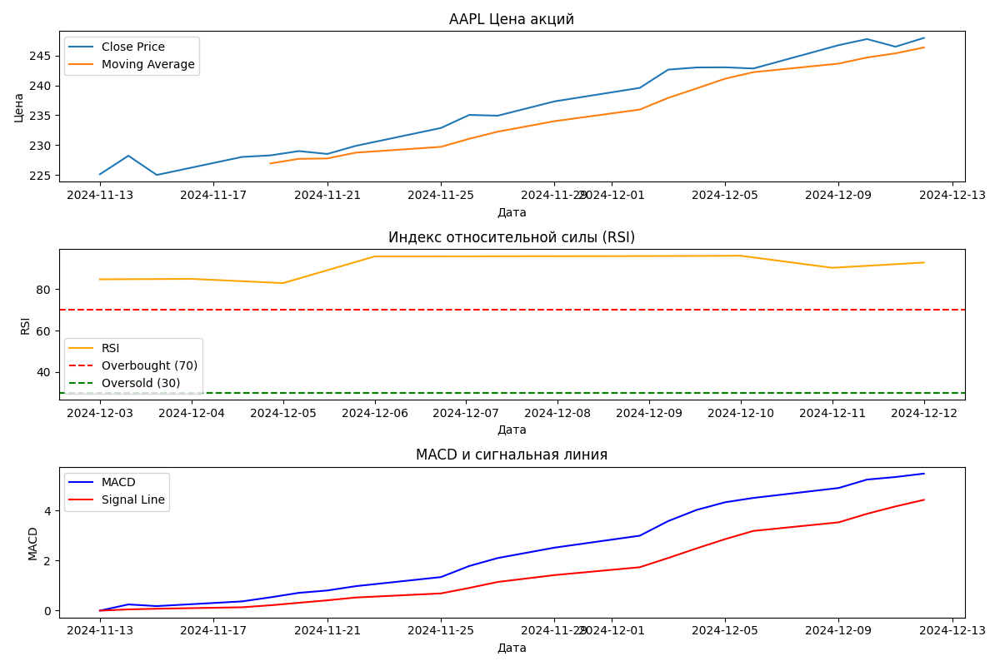
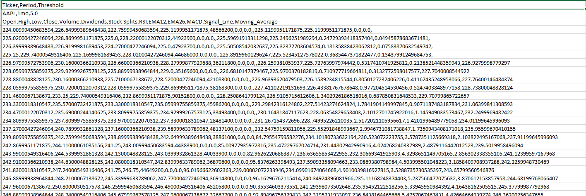

# Инструмент анализа биржевых данных

## Описание проекта

Данный проект позволяет:
1. Получать исторические данные акций с помощью библиотеки `yfinance`.
2. Вычислять среднюю цену закрытия за указанный период.
3. Уведомлять о сильных колебаниях цен акций.
4. Строить графики цен акций и сохранять их в формате `PNG`.
5. Сохранять данные о выбранных акциях в файл формата `CSV`.
---

## Используемые технологии

- Python
- Библиотеки: `yfinance`, `pandas`, `matplotlib`,`os`.

---

## Функционал программы

1. **Получение данных акций:**
   - Загрузка данных по заданному тикеру с Yahoo Finance.
   - Возможность выбора:
     - **Предустановленного периода:** Например, `1mo` (1 месяц), `6mo` (6 месяцев), `1y` (1 год).
     - **Конкретных дат начала и окончания:** Укажите даты в формате `YYYY-MM-DD`.

2. **Средняя цена закрытия:**
   - Вычисление и вывод средней цены закрытия акций за выбранный период.

3. **Уведомление о колебаниях:**
   - Анализ максимальной и минимальной цены закрытия.
   - Вывод предупреждения, если колебания превышают заданный порог (в процентах).

4. **Построение графиков:**
   - Создание графика изменения цены закрытия акций и скользящего среднего.
   - Сохранение графиков в формате PNG с уникальным именем, включающим выбранные параметры.

5. **Просмотр полученных данных:**
   - Сохранение данных акций и параметров пользователя в CSV файл.
   - Возможность открыть сохранённый файл для проверки информации.
---

## Установка

1. Клонируйте репозиторий:
   ```bash
   git clone <https://github.com/nuggetpluto/Analysis_and_visualization_of_stock_data.git>
2. Установите зависимости:
    ```bash
   pip install -r requirements.txt

---

## Как использовать

1. Запустите скрипт:
    ```bash
    python main.py
    ```
2. Введите тикер акции, например `AAPL` для Apple.
3. Выберите способ задания периода:
    - Если вы хотите использовать **предустановленный период** (например, `1mo` для одного месяца), введите `1`, затем укажите период.
    - Если вы хотите указать **конкретные даты начала и окончания**, введите `2`, затем введите даты в формате `YYYY-MM-DD`.
4. Укажите порог колебаний, например `5` для 5%.
5. Введите название, под которым вы хотите сохранить ваш файл, например `mydata`.


---

## Примеры работы

## Пример работы программы

### Использование предустановленного периода 
```bash
Введите тикер акции (например, «AAPL» для Apple Inc): AAPL
Выберите способ задания временного периода:
1. Предустановленный период (например, '1mo', '6mo', '1y')
2. Конкретные даты начала и окончания (формат: YYYY-MM-DD)
Ваш выбор (1 или 2): 1
Введите период для данных (например, '1mo' для одного месяца): 1mo
Введите порог колебаний в процентах (например, 5 для 5%): 5
Введите имя файла для экспорта данных (без расширения): apple_data
```
---
### Использование пользовательских дат 
```bash
Введите тикер акции (например, «AAPL» для Apple Inc): AAPL
Выберите способ задания временного периода:
1. Предустановленный период (например, '1mo', '6mo', '1y')
2. Конкретные даты начала и окончания (формат: YYYY-MM-DD)
Ваш выбор (1 или 2): 2
Введите дату начала (в формате YYYY-MM-DD): 2024-05-01
Введите дату окончания (в формате YYYY-MM-DD): 2024-06-01
Введите порог колебаний в процентах (например, 5 для 5%): 5
Введите имя файла для экспорта данных (без расширения): apple_may_data
```
---
## Скриншоты

### Построенный график:

### Полученный `CSV` файл:



