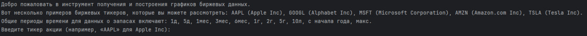
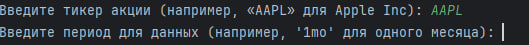
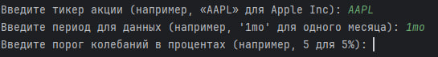
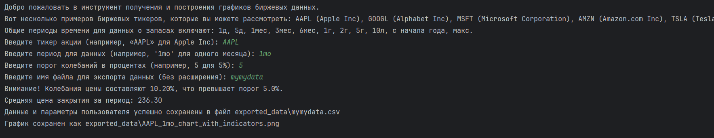

# Инструмент анализа биржевых данных

## Описание проекта

Данный проект позволяет:
1. Получать исторические данные акций с помощью библиотеки `yfinance`.
2. Вычислять среднюю цену закрытия за указанный период.
3. Уведомлять о сильных колебаниях цен акций.
4. Строить графики цен акций и сохранять их в формате `PNG`.
5. Сохранять данные о выбранных акциях в файл формата `CSV`.
---

## Используемые технологии

- Python
- Библиотеки: `yfinance`, `pandas`, `matplotlib`,`os`.

---

## Функционал

1. **Получение данных акций:**
   - Загрузка данных по заданному тикеру и периоду с использованием API Yahoo Finance.
   - Данные сохраняются в CSV-файл с именем `stock_data_<ТИКЕР>_<ПЕРИОД>.csv`.

2. **Средняя цена закрытия:**
   - Вычисление и вывод средней цены закрытия акций за выбранный период.

3. **Уведомление о колебаниях:**
   - Анализ максимальной и минимальной цены закрытия.
   - Вывод предупреждения, если колебания превышают заданный порог (в процентах).

4. **Построение графиков:**
   - Создание графика изменения цены закрытия акций с использованием `gnuplot`.
   - График сохраняется в формате PNG с именем `<ТИКЕР>_<ПЕРИОД>_graph.png`.

5. **Просмотр полученных данных:**
   - Возможность посмотреть первые строки сохранённого файла CSV для проверки содержимого..
---

## Установка

1. Клонируйте репозиторий:
   ```bash
   git clone <https://github.com/nuggetpluto/Analysis_and_visualization_of_stock_data.git>
2. Установите зависимости:
    ```bash
   pip install -r requirements.txt

---

## Как использовать

1. Запустите скрипт:
    ```bash
   python main.py
2. Введите тикер акции, например `AAPL` для Apple.
3. Укажите период, например `1mo` для одного месяца.
4. Укажите порог колебаний, например `5` для 5%.
5. Введите название под которым хотели бы сохранить ваш файл,например `mydata`.

---

## Примеры работы

### Пример 1: Приветственное сообщение и выбор акции.


### Пример 2: Выбор периода просмотра данных.


### Пример 3: Выбор порога колебаний.


### Пример 4: Ввод названия файла `CSV` под которым нужно сохранить данные.


### Пример 5: Итог.

---

## Скриншоты

### Построенный график:

### Полученный `CSV` файл:


