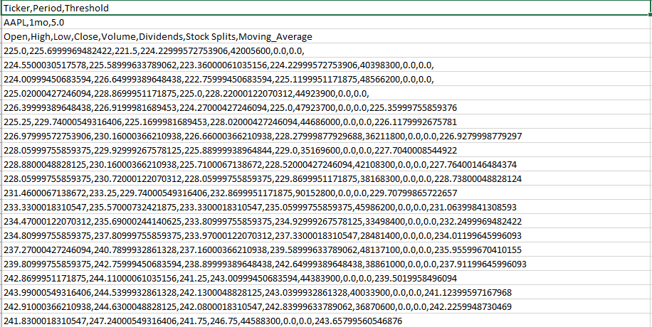

# Инструмент анализа биржевых данных

## Описание проекта

Данный проект позволяет:
1. Получать исторические данные акций с помощью библиотеки `yfinance`.
2. Вычислять среднюю цену закрытия за указанный период.
3. Уведомлять о сильных колебаниях цен акций.
4. Строить графики цен акций и сохранять их в формате `PNG`.
5. Сохранять данные о выбранных акциях в файл формата `CSV`.
---

## Используемые технологии

- Python
- Библиотеки: `yfinance`, `pandas`, `matplotlib`,`os`.

---

## Функционал

- **Получение данных акций**: загрузка данных по заданному тикеру и периоду.
- **Средняя цена закрытия**: вычисление и вывод средней цены закрытия акций за период.
- **Уведомление о колебаниях**: предупреждение пользователя, если колебания превышают заданный порог.
- **Построение графиков**: создание и сохранение графиков изменения цены акций.
- **Просмотр полученных данных**: возможность посмотреть сохраненный файл с информацией о выбранных акциях.
---

## Установка

1. Клонируйте репозиторий:
   ```bash
   git clone <https://github.com/nuggetpluto/Analysis_and_visualization_of_stock_data.git>
2. Установите зависимости:
    ```bash
   pip install -r requirements.txt

---

## Как использовать

1. Запустите скрипт:
    ```bash
   python main.py
2. Введите тикер акции, например `AAPL` для Apple.
3. Укажите период, например `1mo` для одного месяца.
4. Укажите порог колебаний, например `5` для 5%.
5. Введите название под которым хотели бы сохранить ваш файл,например `mydata`.

---

## Примеры работы

### Пример 1: Приветственное сообщение и выбор акции.


### Пример 2: Выбор периода просмотра данных.


### Пример 3: Выбор порога колебаний.


### Пример 4: Ввод названия файла `CSV` под которым нужно сохранить данные.


### Пример 5: Итог.

---

## Скриншоты

### Построенный график:

### Полученный `CSV` файл:



